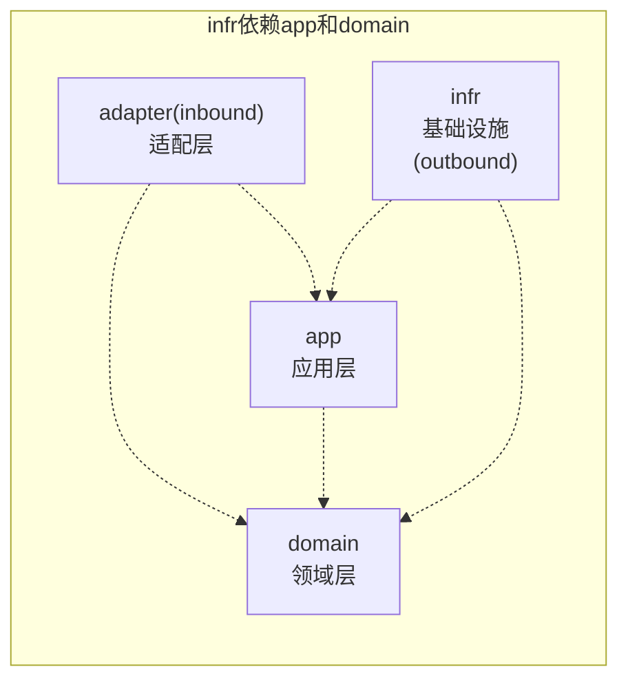

# 示例项目

## 分支说明
- `main`：主分支，存放稳定的代码版本，ORM用的是Jimmer
- `feat-持久化ORM改成Mybatis-Plus`：功能分支，用于将持久化层从原有ORM框架迁移到Mybatis-Plus
- `feat-隔离dev环境，可以连接真实数据库`：功能分支，用于隔离开发环境配置，支持连接真实数据库进行开发调试


## 业务场景
- 购物车编辑商品（新增商品、编辑数量、删除商品）
- 购物车结算下单，下单扣减库存，清空购物车

## 项目信息
- 技术栈：Java 21、Spring Boot 3、PostgreSQL 14、Redis 6.x、MyBatis-Plus、Docker Compose、Maven

## 本地启动
- 本地需要安装docker环境
- start模块
  - `com.xianyu.Application`
- 自动化测试
  - 在命令行执行：`mvn verify`，将运行测试

## 业务模块划分（上下文）
- 订单上下文（order-context）
  - 订单（order）
  - 购物车（cart）
  - reference（外部上下文引用：比如订单（order）引用的外部包裹（parcel）、订单（order）引用的User（实际外部是Customer）
- 订单上下文对外sdk（order-context-sdk）

```text
├── api
│  └── OrderQueryApiService.java # 定义订单查询接口
├── common
│  └── OrderReadOnly.java # 定义订单只读方法，复杂逻辑由聚合根实现，dto只定义简单属性存储即可，对外行为一致
├── dto
│  ├── req
│  │  └── QueryOrderDto.java #定义订单查询参数
│  └── rsp
│      ├── ExtensionDto.java
│      ├── FullAddressLineDto.java
│      ├── FullNameDto.java
│      ├── OrderAddressDto.java
│      ├── OrderDetailDto.java
│      └── OrderReadOnlyDto.java
└── event
    ├── OrderCanceledEvent.java
    └── OrderPlacedEvent.java
```

- 库存上下文（inventory-context）
  - 库存（ventory）
- 库存上下文对外sdk（inventory-context-sdk）

## 模块分层
### 业务模块划分通过 modulith 规范，模块内分层通过 archunit 规范，详见单元测试`com.xianyu.architecture`



## 约束与协作
- `adapter` 仅依赖 `app`/`domain`，作为系统外部到内部的入口
- `app` 仅依赖 `domain`，负责任务编排与 DTO 转换
- `domain` 不依赖其他层，承载业务规则与模型
- `infr` 依赖 `app`/`domain`，完成持久化与外部系统适配

# 目录描述

```
{context}-context/
└── src/main/java/com/xianyu/{context}/context/
    ├── {module}/                 # 业务模块（如：order、cart、product等）
    │   ├── adapter/            # 内部适配层（端口+适配层（方向：从外到内），其实springmvc把http body转dto就是一个适配的过程）
    │   │   ├── task/           # 定时任务
    │   │   ├── web/            # Web接口（资源入口）
    │   │   └── eventhandler/   # 领域事件处理器
    │   ├── app/                # 应用层
    │   │   ├── service/        # 应用服务
    │   │   ├── assembler/      # dto转化为领域模型（Spring管理）
    │   │   ├── dto/            # 数据传输对象（cmd对象、接收前端的参数）
    │   │   └── view/           # 视图对象（以View结尾，返回给前端的视图对象）
    |   ├── domain/                # 领域层
    |   │   ├── factory/           # 领域工厂包
    |   │   ├── repository/        # 仓储接口包
    |   │   ├── service/validator/ # 领域校验器包
    |   │   ├── service/           # 领域服务包
    |   │   ├── value/             # 值对象包
    │   └── infr/                  # 基础设施层（实际是适配层，方向：从内到外）
    │       ├── common/             # 通用包
    │       ├── persistence/        # 数据持久化
    |       │   ├── po/                # 持久化对象（数据模型）
    |       │   ├── repository/        # 仓储包
    |       │   └── mapper/            # MyBatis 映射器包
    │       ├── adapter/        # 外部适配器（实现domain、app的接口）
    │       ├── convertor/      # 数据转换器（领域模型<->数据模型、dto<->领域模型）
    │       └── rpc/            # 远程调用
    └── {module}/               # 其他业务模块
        └── ...                 # 相同的分层结构
```

## 测试相关
- 单元测试继承：`BaseUnitTest`
- mapper单元测试：`BaseMapperUnitTest`
- controller单元测试：`BaseControllerUnitTest`
- 集成测试继承：`BaseIntegrationTest`
- BDD测试：`com.xianyu.CucumberTest`
- 命名规范：`被测类名 + 被测方法名 + Unit/Integration + Test`

## 设计取舍

### DDD和MVC的性能对比？
* 我的业务主要以B端为主，可以容忍冗余的SQL更新
* 如果需要极致的性能，用MVC更好
* 模块自己决定用哪种分层，控制在包内就好
