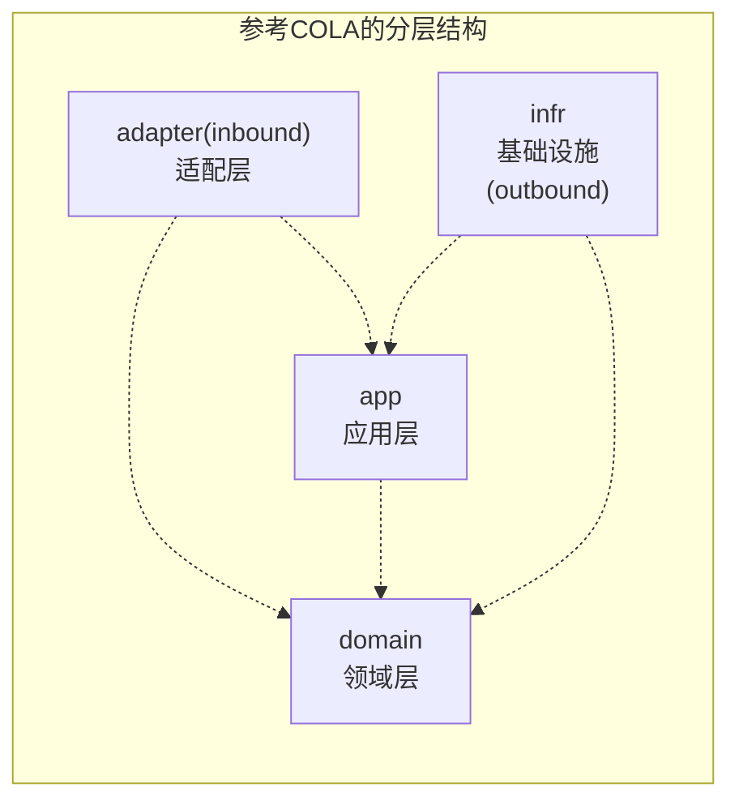

# 子模块分层



## 约束与协作
- `adapter` 仅依赖 `app`/`domain`，作为系统外部到内部的入口
- `app` 仅依赖 `domain`，负责任务编排与 DTO 转换
- `domain` 不依赖其他层，承载业务规则与模型
- `infr` 依赖 `app`/`domain`，完成持久化与外部系统适配

# 目录描述

```
{context}-context/
└── src/main/java/com/xianyu/{context}/context/
    ├── {module}/                 # 业务模块（如：order、cart、product等）
    │   ├── adapter/            # 内部适配层（端口+适配层（方向：从外到内），其实springmvc把http body转dto就是一个适配的过程）
    │   │   ├── task/           # 定时任务
    │   │   ├── web/            # Web接口（资源入口）
    │   │   └── eventhandler/   # 领域事件处理器
    │   ├── app/                # 应用层
    │   │   ├── service/        # 应用服务
    │   │   ├── assembler/      # dto转化为领域模型（Spring管理）
    │   │   ├── dto/            # 数据传输对象（cmd对象、接收前端的参数）
    │   │   └── view/           # 视图对象（以View结尾，返回给前端的视图对象）
    |   ├── domain/                # 领域层
    |   │   ├── factory/           # 领域工厂包
    |   │   ├── repository/        # 仓储接口包
    |   │   ├── service/validator/ # 领域校验器包
    |   │   ├── service/           # 领域服务包
    |   │   ├── value/             # 值对象包
    │   └── infr/                  # 基础设施层（实际是适配层，方向：从内到外）
    │       ├── common/             # 通用包
    │       ├── persistence/        # 数据持久化
    |       │   ├── po/                # 持久化对象（数据模型）
    |       │   ├── repository/        # 仓储包
    |       │   └── mapper/            # MyBatis 映射器包
    │       ├── adapter/        # 外部适配器（实现domain、app的接口）
    │       ├── convertor/      # 数据转换器（领域模型<->数据模型、dto<->领域模型）
    │       └── rpc/            # 远程调用
    └── {module}/               # 其他业务模块
        └── ...                 # 相同的分层结构
```